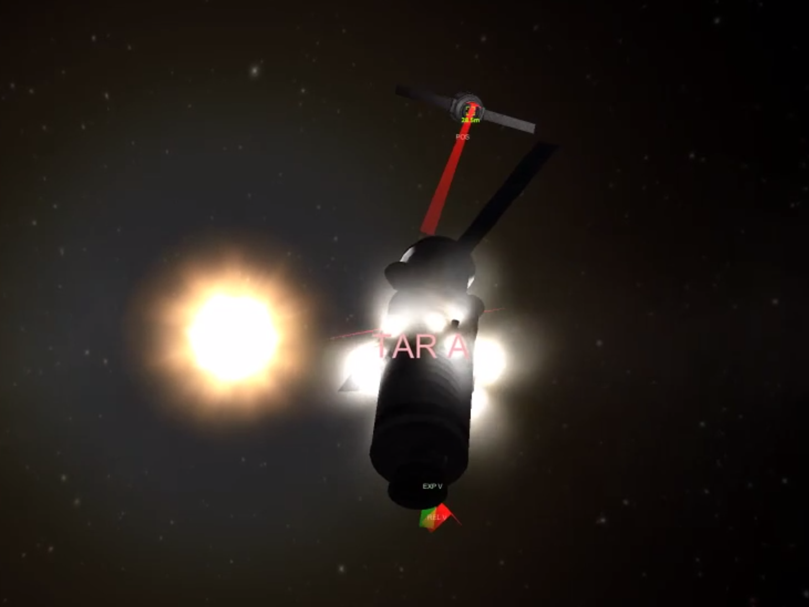
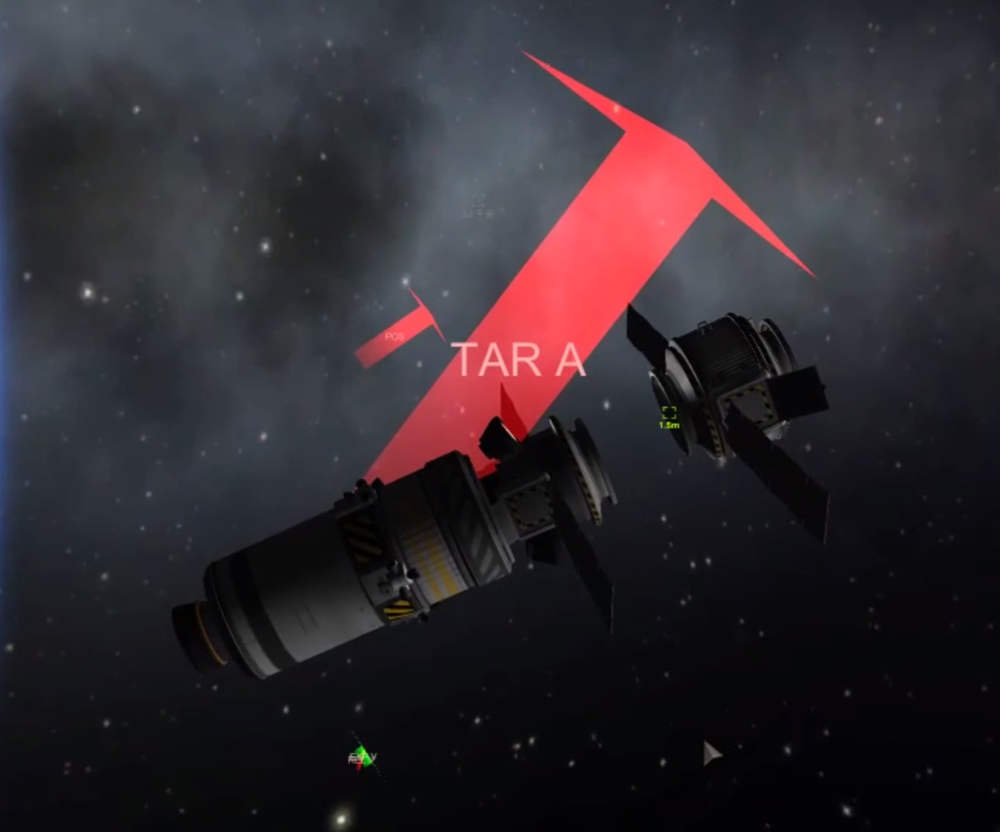

# 在轨飞行器对接

## 功能

1. 用火箭发动机接近目标
2. 用 RCS 进行对接

也可单独用于接近目标或近距离对接。

## 介绍

视频：[自动发射和对接程序演示 - bilibili](https://www.bilibili.com/video/av45130158)。全长 12 分钟，未经剪辑，对接从 7:15 开始。有时间会把剪辑、加速后的视频放出来。

距离远时先用火箭加速、维持方向、减速，近距离用 RCS 调整姿态并对接。用点火的方式辨识动力模型（阶跃），但因为向心力的影响和速度差分的误差导致结果不太好。当时科技树还造不出加速度计，之后会改进。

大油门转向和推进，手操是不可能的。





## 脚本

``` VB
runpath("docking", velocity, throttle, distance).
```

- `velocity`：接近速度。一般来说速度越大越费油，加速减速都需要消耗燃料；速度越小接近时间越长，期间矫正轨道变化消耗的燃料越多。
- `throttle`：减速时期望 throttle。
- `distance`：接近距离。如果目标比较大，为了避免碰撞，需要给一个比较大的距离。

## 用法

1. 接近：
    - 在地图界面选中目标。
    - 运行脚本。
    - 到达指定距离停下后等待。
2. 对接：
    - 调整飞船至安全位置，保证两个 docking port 之间没有障碍。
    - 选定目标 docking port 为目标。
    - 选定飞船 docking port 为控制点。
    - 脚本会继续运行或手动启动脚本。
    - 等待对接成功。

## 注意

- 需要加速度传感器。
- 需要 RCS 推进器。
    - 最好安装在质心附近。
    - 保证有 6 个方向的推进力，每 2 个相反方向推力保持一致。
- Docking port 可以安装在侧面。
